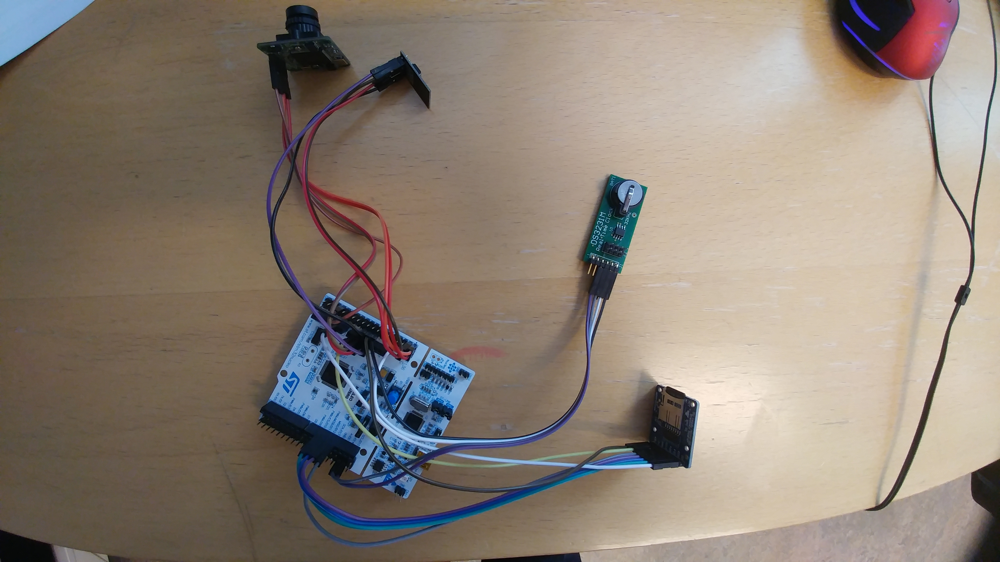

# List of prototypes

## EC3 - Edge Command-Control-Communication System for Arctic Observatories (Master Thesis)

It was a project that my master thesis was based on. RPi3B, DHT22, RTC, Camera, LoRa, Arduino Pro Mini to control when power is enabled/disabled for RPi3B. UART communication between RPi and Arduino.

More information about the project can be found here:
- [Master Thesis](https://munin.uit.no/handle/10037/11149)
- [Publication 1: Flexible Devices for Arctic Ecosystems Observations ](https://ojs.bibsys.no/index.php/NIK/article/view/435)

## Camera Observation Unit

We tried to create MCU-based, movement-triggered observation unit. The prototype consisted of a microcontroller, serial camera, rtc, uSD card, motion sensor, and wifi module. MCU used: ESP8266 (running micropython), Arduino Pro  Mini, and STM32L476 (running mbed os, pictures below).

Source code:
- [github](https://github.com/sergiuszm/stm32l476rg_ucam)

## Insects Trap

Control unit for UV LED strip (that were supposed to attract insects). The LED strip could be enabled/disabled based on the value from photoresistor or remotely via LoRa message.

LED basked was build by Ken-Arne. The basked can be seen in the video posted in the next section.

Source code:
- [github](https://github.com/sergiuszm/insects_trap)

## EmGO - offloading tasks in BIGLittle architecture (BIG: RPi3B, Little: STM32L476RG)

A quick look at the BIGLittle architecture. We experimented with interfaces between Go and EmGO. We used a benchmark to compare computacional speed between boards and the speed of data passing routine - part of the benchmark was running on stm32 board.

More information can be found in the publication:
- [Publication 2: CSP at the Cyber-Physical Edge](https://ebooks.iospress.nl/volumearticle/51254)

## Ni-Mh batteries and special electrical pad

Evaluation of an idea where battery pack in placed on a special pad for easy replacement. The pack can be replaced by UAV. We used special rechargable batteries (Ni-Mh Panasonic BK-1100FHU) that should maintain the advertised capacity even in a cold temperature.

Battery pack was designed and built by Ken-Arne.

Video with the presentation of the idea (drone, insects trap, battery): [youtube](https://youtu.be/tnH-1RpeiBI)

## "Basketball" Unit

Observation Unit build together with other PhD students: Roberth and Mike.

RPi3B based with GPS, motion sensor, camera, 4G usb modem, external temperature sensor. The additional SleepyPi mounted at the top (40 GPIO pins) made sure the RPi3B was not using a lot of energy when powered down. The unit was "deployed" in the freezer with temperature set to -37C.

## Prototype for measuring and reporting energy usage of other (target) prototypes

We build a few prototypes of units capable of measuring and do real time reporting of the energy usage of the other prototypes we were interested in. We used INA-219 as the sensor to measure energy. We experimented with PyCom FiPy, RPi Zero, and RPi3B as the control unit. We tried to host a simple http server on the control unit for live monitoring (over WiFi connection). Small LCD display was used for debugging and live monitoring when other (target) prototypes were being evaluated.

Source code:
- [github](https://github.com/sergiuszm/ina_219_energy_usage)

## Connectivity Autonomy Experiments

Prototype based on PyCom FiPy with RTC, uSD, and internal and external temperature sensor. Prototype was powered by batteries (12Ah@5V). PCB was placed in water-tight box. 

Experiments involved LTE M1, NB-IoT under bad weather conditions. We deployed two units outside and we kept one in the freezer (-37C):
- units placed outside in the winter
- working only on battery power
- only remote software updates

Source code:
- [cae_fipy](https://github.com/sergiuszm/cae_fipy)
- [nbiotpy](https://github.com/arcticobservatory/nbiotpy)

One of the units before deployment:

One of the units after three months outside and under the snow:

Node schematic:

## LoRaLitE Nodes

Publication title: LoRaLitE: LoRa protocol for Energy-Limited environments

Authors: Lukasz Sergiusz Michalik, Loic Guegan, Issam Raïs, Otto Anshus and John Markus Bjørndalen

DOI: [10.1109/MASCOTS56607.2022.00018](https://doi.org/10.1109/MASCOTS56607.2022.00018)

Real node data vs simulation results:

Debugging prototypes:

Node schematic:

Link to the first version of the LoRaLitE simulator:
- [github](https://github.com/arcticobservatory/loralite)

More refactored version with the second version of the protocol will be available in the future. Hopefuly, before the end of the year (2023).

## Longyearbyen :)

